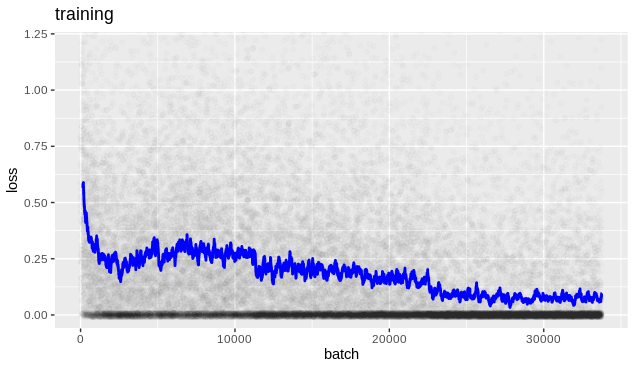
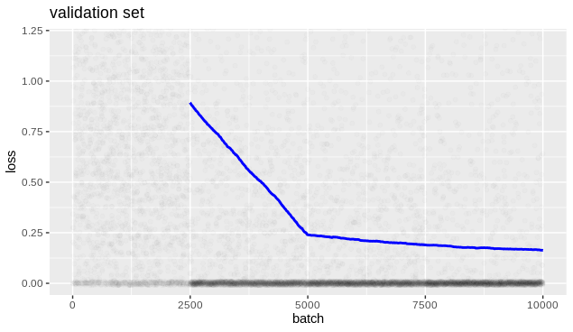
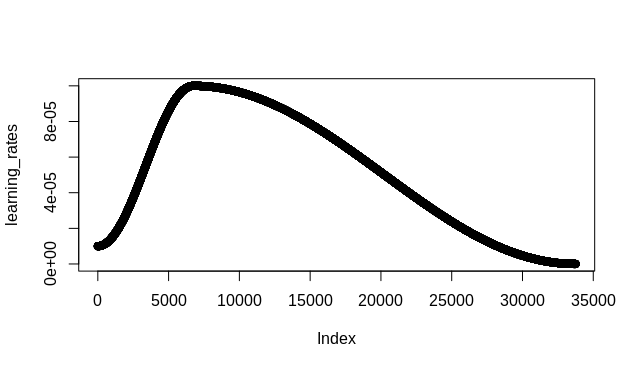

```{r, include = FALSE}
knitr::opts_chunk$set(
  collapse = TRUE,
  eval = FALSE,
  comment = "#>"
)
```

```{r setup}
library(torch)
library(torchtransformers)
library(dplyr)
library(wordpiece)
library(progress)
library(ggplot2)
```

This vignette will walk through the process of training a "triplet" model to 
produce sentence embeddings for some task. 

Each training example for this type of model consists of three pieces of input
text: the anchor, the positive example, and the negative example. The training
loss for the model will be the _difference_ in the distance from the anchor to
the negative example and the distance to the positive example. The loss is
minimized during training, so the model learns to put the anchor closer to the
positive example than to the negative example.

After enough training, the hope is that the model has learned to make useful
representations for the input examples. The model can then be used to generate
embedding vectors for any input sentences.


## Prepare the dataset


### Get the data

The data we will use for this vignette is derived from NLI datasets, and can be
obtained from
https://www.sbert.net/examples/training/paraphrases/README.html#datasets

```{r}
# Download data and transform into a more usable format.
data_url <- "https://public.ukp.informatik.tu-darmstadt.de/reimers/sentence-transformers/datasets/paraphrases/AllNLI.jsonl.gz"

data_dest <- tempfile("data_", fileext = ".txt")
download.file(data_url, data_dest)
data_string <- readLines(data_dest)

# The data is in json format. There are three sentences per line.
data_list <- purrr::map(data_string, jsonlite::fromJSON)
data_list[[1]]
# [1] "A person on a horse jumps over a broken down airplane."
# [2] "A person is outdoors, on a horse."                     
# [3] "A person is at a diner, ordering an omelette."  
```

### Lightly clean the data

A few of the "sentences" in the dataset are rather long and incoherent. Let's
just remove any examples with an excessive character count.


```{r}
max_allowed_char <- 300L # That's still a pretty long sentence
num_chars <- purrr::map_int(data_list, function(l) max(nchar(l)))
data_list_short <- data_list[num_chars <= max_allowed_char]
# We still have almost 99% of the original dataset.
length(data_list_short)/length(data_list)
# [1] 0.9887422
# Keep our memory clean!
rm(data_list)
```


### Tokenize the data

The model we will train will be built with BERT, which uses wordpiece
tokenization.

First, download the wordpiece vocabulary and load using the {wordpiece} package.

```{r}
# BERT uncased vocabulary can be downloaded from:
vocab_url <- "https://huggingface.co/bert-base-uncased/resolve/main/vocab.txt"
vocab_file <- "wordpiece_uncased_vocab.txt"
download.file(vocab_url, vocab_file)

vocab <- wordpiece::load_or_retrieve_vocab(vocab_file, use_cache = TRUE)
```

We need to tokenize each sentence. 

The {wordpiece} package doesn't (yet) make it easy to pad tokenized sequences to
a given length, but we'll need the inputs padded to use with our model. Here are
some helper functions to convert the tokenized data into the right format.

```{r}
pad_vector <- function(x, len, padding) {
  if (length(x) >= len) {
    return(x[1:len])
  }
  return(c(x, rep(padding, len - length(x))))
}

tokenize_with_padding <- function(text_list,
                                  vocab,
                                  pad_to_length = NULL,
                                  sep_token = "[SEP]",
                                  cls_token = "[CLS]",
                                  pad_token = "[PAD]") {
  sep_index <- vocab[[sep_token]]
  names(sep_index) <- sep_token
  cls_index <- vocab[[cls_token]]
  names(cls_index) <- cls_token
  pad_index <- vocab[[pad_token]]
  names(pad_index) <- pad_token
  
  to_return <- purrr::map(seq_along(text_list), function(i) {
    text <- text_list[[i]]
    tokenized <- wordpiece::wordpiece_tokenize(text = text,
                                               vocab = vocab)
    inner_return <- c(cls_index, tokenized, sep_index)
    if (!is.null(pad_to_length)) {
      inner_return <- pad_vector(inner_return,
                                 len = pad_to_length,
                                 padding = pad_index)
    }
    inner_return
  })
  
  # Add one to the indices for torch! 
  to_return <- purrr::map(to_return, function(x) {x + 1})
  return(to_return)
}
```

Let's tokenize! This can take a while, so we only want to do this once.

```{r}
# 64 tokens will cover *most*, but not all, of the sentences in this dataset.
# A few sentences will get truncated, but that's ok for this vignette.
max_tokens <- 64L
# The dataset is a list of 3-element character vectors. After tokenization, it
# will be a list of 3-element lists, where each element is a tokenized sentence.

# It will take several hours to tokenize all the examples. For this vignette,
# let's just tokenize the first 50K examples.
data_tokenized <- purrr::map(data_list_short[1:50000], 
                             tokenize_with_padding,
                             vocab = vocab,
                             pad_to_length = max_tokens)
# It's a good idea to save the tokenized data before proceeding.
# saveRDS(data_tokenized, "tokenized_examples.rds")
# data_tokenized <- readRDS("tokenized_examples.rds")
```

### Create torch dataset

A dataset in torch is managed by creating a `dataset` object. Actually, we need
to *extend* the `Dataset` class and make a custom class that implements certain
methods. In particular, the `.getitem` method is how our datasets will serve up
examples.

```{r}
my_dataset <- torch::dataset(
  name = "triplet_dataset", 
  
  initialize = function(tokenized_list) {
    nt <- length(tokenized_list[[1]][[1]])
    anchor <- vapply(X = tokenized_list, 
                     FUN = function(ex) {as.integer(ex[[1]])}, 
                     FUN.VALUE = integer(nt))
    positive <- vapply(X = tokenized_list, 
                       FUN = function(ex) {as.integer(ex[[2]])}, 
                       FUN.VALUE = integer(nt))
    
    negative <- vapply(X = tokenized_list, 
                       FUN = function(ex) {as.integer(ex[[3]])}, 
                       FUN.VALUE = integer(nt))

    self$anchor <- torch_tensor(anchor)
    self$positive <- torch_tensor(positive)
    self$negative <- torch_tensor(negative)
  },

  .getitem = function(i) {
    anchor <- self$anchor[, i]
    positive <- self$positive[, i]
    negative <- self$negative[, i]
    list(anchor = anchor, positive = positive, negative = negative)
  },
  
  .length = function() {
    dim(self$anchor)[2]
  }
)

```

We actually want two datasets: one for training, and one for validation.

```{r}
# Randomly pick 10% of data to hold out for validation.
set.seed(123) 
val_frac <- 0.1
tot_ex <- length(data_tokenized)
val_indices <- sample(1:tot_ex, size = floor(val_frac * tot_ex))
train_indices <- setdiff(1:tot_ex, val_indices)

train_ds <- my_dataset(data_tokenized[train_indices])
val_ds <- my_dataset(data_tokenized[val_indices])
```

We don't interact directly with the datasets; we do it via a dataloader. The
dataloaders handle batching, and some other details of the data loading process.

```{r}
# define a collation function so that the batch is structured correctly.
# Apparently, by default the dataloader puts the batch dimension first when
# constructing batches, but out model expects it to be the second dimension.
collate_fn <- function(batch) {
  # See this blog post for tips on constructing the collation function:
  # https://blogs.rstudio.com/ai/posts/2021-02-04-simple-audio-classification-with-torch/
  anchor <- torch::torch_stack(sapply(batch, function(b) {b$anchor}), 2)
  positive <- torch::torch_stack(sapply(batch, function(b) {b$positive}), 2)
  negative <- torch::torch_stack(sapply(batch, function(b) {b$negative}), 2)

  return(list(anchor = anchor,
              positive = positive,
              negative = negative))
}

train_dl <- dataloader(train_ds, batch_size = 4L, shuffle = TRUE, 
                       collate_fn = collate_fn)
val_dl <- dataloader(val_ds, batch_size = 2L, collate_fn = collate_fn)
```


## Defining the model

We're going to build a "triplet" model with a BERT pre-trained spine.
We use the `make_and_load_bert` function to get a BERT module with pre-trained
weights loaded.

```{r}
# This module defines the "spine" of the model. It's basically BERT, with
# the final CLS token taken as the output, then a dense layer after that.

# Using pre-trained weights to start.
spine_with_pooling <- torch::nn_module(
  "pooled",
  initialize = function(model_name = "bert_base_uncased") {
    # TODO: we should export this df.
    config <- torchtransformers:::bert_configs
    embedding_size <- config$embedding_size[config$model_name == model_name]
    self$bert <- torchtransformers::make_and_load_bert(model_name)
    # After pooled bert output, do a final dense layer.
    self$linear <- torch::nn_linear(in_features = embedding_size, 
                                    out_features = embedding_size)
  },
  forward = function(token_ids, token_type_ids) {
    output <- self$bert(token_ids, token_type_ids)
    
    # Take the output embeddings from last layer.
    output <- output$output_embeddings
    output <- output[[length(output)]]
    # Take the [CLS] token embedding for "pooling".
    output <- output[1, , ]
    # Apply the last dense layer to the "pooled" output.
    output <- self$linear(output)
    return(output)
  }
)

# The model is just the same spine used for three inputs:
triplet_for_training <- torch::nn_module(
  "triplet",
  initialize = function(model_name = "bert_mini_uncased") {
    # Share the same spine parameters between all three inputs.
    self$spine <- spine_with_pooling(model_name)
  },
  forward = function(anchor, positive, negative, tt) {
    # For this particular dataset, all the token type id inputs are trivially
    # the same, so we only need a single input for that.
    v_anchor <- self$spine(anchor, tt)
    v_positive <- self$spine(positive, tt)
    v_negative <- self$spine(negative, tt)
    
    return(list("anchor" = v_anchor,
                "positive" = v_positive,
                "negative" = v_negative))
  }
)

# Now make the actual model:
torch::torch_manual_seed(123456)
model <- triplet_for_training("bert_small_uncased")
model
# An `nn_module` containing 28,763,648 parameters.
# 
# ── Modules ────────────────────────────────────────────────────────────────
# • spine: <pooled> #28,763,648 parameters
```

The output of the model will be three vectors, one for each input.

Note: BERT models (like the one used in the triplet model) require two inputs
for each piece of input text. The second input identifies the "token type", and
is used to allow BERT to distinguish between multiple segments within a single
input sequence. For this particular model, all the inputs are single-segment,
so the token type tensor will just be filled with ones.

## Training


For each epoch of training, we will calculate the loss on the validation set as 
well.

We use a learning rate schedule that "warms up" to a maximum, then gradually
decreases.

```{r}
# The triplet margin loss is key to this whole process!
loss_fun <- torch::nnf_triplet_margin_loss

learning_rate <- 1e-4

model$cuda() # Have to do this *before* creating optimizer!

optimizer <- optim_adam(model$parameters, lr = learning_rate)

epochs <- 3

# Just to illustrate the process, use a learning rate scheduler.
scheduler <- optimizer %>%
  lr_one_cycle(max_lr = learning_rate,
               epochs = epochs,
               steps_per_epoch = length(train_dl),
               pct_start = 0.2,
               div_factor = 10,
               final_div_factor = 1000)

# Set up some empty vectors to keep track of things during training.
losses <- c()
learning_rates <- c()
val_losses <- c()

# Set the device for the input tensors.
device <- "cuda"

# Set up a slick progress bar!
set_progress_bar <- function(total) {
  progress_bar$new(
    total = total, clear = FALSE, width = 75,
    format = ":current/:total [:bar] - :elapsed - loss: :loss; lr: :lr"
  )
}

# For reference, calculate loss on validation set once before doing any
# training:
model$eval()
pb <- set_progress_bar(length(val_dl))
this_epoch_val_losses <- c()
pb$message("Run on validation set before training loop")
coro::loop(for(batch in val_dl) {
  with_no_grad({ # Important to make sure we don't fill up memory!
    # For this particular dataset, all the token type id inputs are trivially
    # the same, up to the batch size. Just construct the tt input here to
    # simplify things.
    tt <- torch_tensor(array(1L, dim = dim(batch[[1]])), device = device)
    output <- model(batch[[1]]$to(device = device),
                    batch[[2]]$to(device = device),
                    batch[[3]]$to(device = device),
                    tt
    )
  })
  loss <- loss_fun(output$anchor, output$positive, output$negative)
  loss_r <- as.numeric(loss$item())
  val_losses <- c(val_losses, loss_r)
  this_epoch_val_losses <- c(this_epoch_val_losses, loss_r)
  pb$tick(tokens = list(loss = round(mean(this_epoch_val_losses), 4)))
})
  
# Now do training loop.
for(epoch in seq_len(epochs)) {
  model$train() # Make sure the model is in training mode!
  this_epoch_losses <- c()
  this_epoch_val_losses <- c()

  pb <- set_progress_bar(length(train_dl))
  pb$message(glue::glue("Epoch {epoch}/{epochs}"))
  coro::loop(for(batch in train_dl) {
    optimizer$zero_grad()
    # Construct tt input here.
    tt <- torch_tensor(array(1L, dim = dim(batch[[1]])), device = device)
    output <- model(batch[[1]]$to(device = device), # anchor
                    batch[[2]]$to(device = device), # positive
                    batch[[3]]$to(device = device), # negative
                    tt 
    )
    
    loss <- loss_fun(output$anchor, output$positive, output$negative)
    loss$backward()
    optimizer$step()
    scheduler$step() # This needs to come after the optimizer step.
    lr <- scheduler$get_lr() # Keep track of the current learning rate.

    loss_r <- as.numeric(loss$item())
    losses <- c(losses, loss_r)
    learning_rates <- c(learning_rates, lr)
    this_epoch_losses <- c(this_epoch_losses, loss_r)

    pb$tick(tokens = list(loss = round(mean(this_epoch_losses), 4), 
                          lr = round(lr, 6)))
  })
  
   # For each epoch, calculate loss on validation set.
  model$eval()

  pb <- set_progress_bar(length(val_dl))
  pb$message(glue::glue("Validation for epoch {epoch}/{epochs}"))

  coro::loop(for(batch in val_dl) {
    with_no_grad({ # Important to make sure we don't fill up memory!
      tt <- torch_tensor(array(1L, dim = dim(batch[[1]])), device = device)
      output <- model(batch[[1]]$to(device = device),
                      batch[[2]]$to(device = device),
                      batch[[3]]$to(device = device),
                      tt
      )
    })
    loss <- loss_fun(output$anchor, output$positive, output$negative)
    
    loss_r <- as.numeric(loss$item())
    val_losses <- c(val_losses, loss_r)
    this_epoch_val_losses <- c(this_epoch_val_losses, loss_r)
    pb$tick(tokens = list(loss = round(mean(this_epoch_val_losses), 4)))
  })
}

```

Let's save the trained model:

```{r}
# We will also load these weights into a "vectorizer" model later.
model_weights <- model$state_dict()
torch::torch_save(model_weights, "triplet_model_weights")
```

It's interesting to look at how the loss changes over the training process.

```{r}
# Here's a handy function for plotting the losses.

plot_losses <- function(loss_vector, smoothing = 1000, title = "") {
  loss_df <- dplyr::tibble(loss_vector) %>% 
    dplyr::mutate(row = row_number(),
                  roll = zoo::rollmeanr(loss_vector, k = smoothing, fill = NA)) 
    
  loss_df %>% 
    ggplot2::ggplot(aes(x = row, y = loss_vector)) +
    ggplot2::geom_jitter(alpha = 0.01, width = 0, height = 0.01) +
    ggplot2::geom_line(aes(x = row, y = roll), color = "blue", size = 1) +
    coord_cartesian(ylim = c(0, 1.2)) +
    xlab("batch") +
    ylab("loss") +
    ggtitle(title)
}

# There were 2500 batches in the validation set. Look at the last round of
# validation:
mean(tail(val_losses, 2500)) # 0.164
# A loss below 1 indicates that anchor was closer to positive than to negative.
# What fraction of validation set had loss < 1?
mean(tail(val_losses, 2500) < 1) # 0.94

# Plot the training and validation loss:
plot_losses(losses, 150, "training")
plot_losses(val_losses, 2500, "validation set")
```

After three epochs of training, the loss on the validation set is about 0.16,
with 94% of validation batches having a loss less than 1.0.




For reference, here's how the learning rate changed during training:

```{r}
plot(learning_rates)
```



## Evaluate the results

Training is just the first step.

### Populating the vector space

We can use the trained model to generate embedding vectors.

```{r}
# Define a new model to vectorize a single input.
# This model has the same parameters as the triplet model, but only takes a 
# single text input.

# The model is just the same spine used for three inputs:
vectorizer <- torch::nn_module(
  "vectorizer",
  initialize = function(model_name = "bert_mini_uncased") {
    self$spine <- spine_with_pooling(model_name)
  },
  forward = function(input, tt) {
    v <- self$spine(input, tt)
    return(v)
  }
)

vectorizer_model <- vectorizer("bert_small_uncased")

vectorizer_model$load_state_dict(model_weights)
vectorizer_model$cuda()
vectorizer_model$eval()
# Pick a random row from the validation data:
set.seed(123456)
test_case <- sample(data_tokenized[val_indices], 1)[[1]]

# Vectorize each sequence.
n_tokens <- length(test_case[[1]])
device <- "cuda"
# We have to make sure the input is integers, and then use that to define an
# array so that there's an explicit batch dimension, and *then* convert to a
# torch tensor.
anchor <- torch::torch_tensor(array(as.integer(test_case[[1]]), 
                                    dim = c(n_tokens, 1L)), device = device)
positive <- torch::torch_tensor(array(as.integer(test_case[[2]]), 
                                      dim = c(n_tokens, 1L)), device = device)
negative <- torch::torch_tensor(array(as.integer(test_case[[3]]), 
                                      dim = c(n_tokens, 1L)), device = device)
# Use the same tt for all inputs...
tt <- torch_tensor(array(1L, dim = dim(anchor)), device = device)

# Make the vectors!
# Convert them to cpu, then to R data type.
anchor_v <- torch::as_array(vectorizer_model(anchor, tt)$to(device = "cpu"))
positive_v <- torch::as_array(vectorizer_model(positive, tt)$to(device = "cpu"))
negative_v <- torch::as_array(vectorizer_model(negative, tt)$to(device = "cpu"))

```

### Comparing vectors

The usual way to compare vectors in a high-dimensional embedding space is to
calculate the cosine similarity, which is basically the dot product after
normalizing to unit vectors.

```{r}
# Let's make our own function to compute cosine similarity.
cosine_sim <- function(v1, v2) {
  v1 <- as.vector(v1)
  v2 <- as.vector(v2)
  
  norm1 <- sqrt(sum(v1^2))
  norm2 <- sqrt(sum(v2^2))

  dot <- sum(v1 * v2)
  return(dot/(norm1 * norm2))
}

# The cosine similarity of a vector with itself is identically 1.
cosine_sim(anchor_v, anchor_v)
# The closer cosine similarity is to 1, the closer the two vectors are.
cosine_sim(anchor_v, positive_v) # 0.79
cosine_sim(anchor_v, negative_v) # 0.48
```

In this case, the positive example is closer to the anchor than the negative
example is, as it was trained to be.
